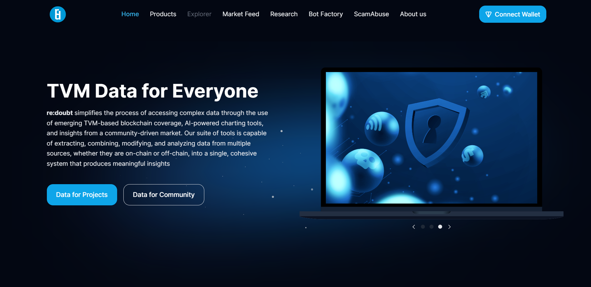

# TONalytica, TVM Data for Everyone!

***Written by:** [**Alireza Tabatabaeian**](https://t.me/alirezatabatabaeian)*

**In this article, we'll delve into a comprehensive review of TONalytica, shedding light on what it is and how it can be a game-changer for your needs.**

**TONalytica, brought to you by the innovative newcomers at RE:DOUBT, is a fusion of "TON" and "Analytics." This amalgamation signifies its primary purpose: to empower you with the ability to analyze the TON network and its invaluable data.**

**Now, let's embark on a closer examination of this exceptional application and explore the myriad of benefits it brings to the table!**

**To begin, navigate to their [WEBSITE](https://beta.redoubt.online/). Upon arrival, you'll encounter a webpage resembling the following:**

**Indeed, the website offers a range of useful tools, including the intriguing Market Feed and the innovative Bot Factory. However, for the purposes of this article, we'll embark on a deep dive into the Research tab, where the heart of TONalytica resides.**

**Once you click on the Research button, you'll be greeted with the following page:**

**As you can see, the Research tab houses an array of popular dashboards, each offering unique insights and valuable data. Feel free to explore some of these dashboards to gain a better understanding of their offerings.**

**Now, let's dive back into our task at hand. The TONalytica button, conveniently situated on the right side of the page, grants access to the analytical treasure trove. To unlock its potential, you'll need to log in through your GitHub account. If you don't already have one, worry not; you can easily create a free GitHub account by clicking [HERE](https://github.com/join).**

**Once you've successfully logged in, you'll find yourself on the following page:**

**Now, let's take a closer look at the left sidebar on the page, where you'll find two essential tools: Dashboards and Queries. First, let's dive into Queries, as they serve as the foundational building blocks of a dashboard.**

**For those familiar with databases, the concept of queries is likely already in your wheelhouse. However, if you're new to this realm, don't fret – I'll provide a brief explanation right here with a simple question and answer.**

**What are databases, and what's the relationship between a query and a database?**

**A database is essentially a structured, multi-column table where you can store your data. Each column within this table has a distinct name, and you can retrieve specific values stored in the database through a process known as querying.**

**Now that you have a grasp of what a query entails, it's time to harness this powerful tool within TONalytica. Trust me; it's much more straightforward than you might imagine!**

## Queries Tab

**In this section, we will introduce you to the most valuable tables or datasets within TONalytica. Our goal is to prepare you to write a query that you can later utilize in crafting your own dynamic dashboard. So, without further ado, let's jump right in and get started on this exciting journey!**

### 1- Tables

**When you click on the "Queries" tab, you'll be greeted with the following page:**

**As you explore the "Queries" tab, you'll notice that you have the ability to view queries that others have made. You can freely copy and modify these queries in your own workspace to tailor them to your specific requirements. Additionally, you can make use of any published queries when you create your dashboard later on.**

**However, for now, let's focus on creating our own query. To do this, click on the "New Query" button located in the upper right corner, which will lead you to the following page:**

**To dive deeper into the tables, you'll notice on the left side that there's a list of tables available. By clicking on each of these tables, a list of columns associated with that table will be revealed below.**

**For the purpose of this article, we'll be focusing on the most crucial tables that pertain to TON price, jettons, and DEXes, along with a comprehensive exploration of their respective columns. Let's explore these tables in greater detail:**

- ***`REDOUBT.TON_USD_RATES`***
    
    ***`id:` This column represents a unique identifier for each row in the table, starting from 1,***
    
    ***`build_time:` This column records the specific time at which the data was recorded,***
    
    `***rate:` The 'rate' column contains the exchange price of TON in relation to USD at a given point in time***
    

- ***`REDOUBT.TON_PRICES`***
    
    `***close:` it’s the closing price (of the day specified in timestamp)***
    
    `***high:` it’s the highest price (of the day specified in timestamp)***
    
    `***id:` each row in table has an id  starting from 1***
    
    `***low:` it’s the lowest price (of the day specified in timestamp)***
    
    `***marketcap:` it’s the overall market cap till the timestamp***
    
    `***open:` it’s the opening price (of the day specified in timestamp)***
    
    ***`timestamp:` it’s the time in which data was recorded***
    
    `***volume:` it’s the trading volume (of the day specified in timestamp)***
    

- `***REDOUBT.TON_USD_RATE_LATEST***`
    
    `***rate:` it’s the exchange rate of TON-USD for at most 20 minutes ago***
    

- `***REDOUBT.TX_FEES_TOTAL_1***`
    
    `***to_timestamp:` it’s the time in which data was recorded,***
    
    `***total_fee:` the total fee used in a day specified in to_timestamp***
    

- `***REDOUBT.JETTON_WALLETS***`
    
    `***balance:` the balance of the wallet,***
    
    `***id:` each row in table has an id  starting from 1,***
    
    `***jetton_master:` the address of the jetton master,***
    
    `***owner:`*** 
    
    `***wallet_address:`*** 
    

- `***REDOUBT.ACTIVE_JETTONS_INFO***`
    
    `***address:`*** 
    
    `***admin_address:`*** 
    
    `***decimals:`*** 
    
    `***market_volume_ton:`*** 
    
    `***price:` the current price of the jetton,***
    
    `***symbol:` the symbol of the jetton,***
    
    `***total_tvl:`*** 
    

**Now let’s write a simple query to get stable jettons data and then plot them on a canvas.**

**If you're not familiar with SQL query syntax, you can learn it through various resources:**

- **Explore Existing Queries: Check out the queries written by others on the previous page to get insights into their structure and logic.**
- **YouTube Videos: There are many video tutorials on YouTube, like ([YouTube videos](https://www.youtube.com/watch?v=AFY3z4FwRg0)), that can teach you the basics of SQL queries.**
- **Articles: Online articles and tutorials, such as [this one](https://www.freecodecamp.org/news/learn-sql-queries-database-query-tutorial-for-beginners/), provide step-by-step guidance on writing SQL queries.**
- **Explore ChatGPT's Application: The "[applying re:doubt & ChatGPT to analyze TON](https://twitter.com/metaverserk/status/1688240842245382144?s=20)" article by “[@metaverserk](https://t.me/metaverserk)” can also be a valuable resource for learning how to apply ChatGPT to write queries.**

**To plot the stable coin prices and TON rate over time to assess their stability, you can use the `REDOUBT.JETTONS_MARKET_DATA` table to retrieve price history data. Specifically, you will need the `build_time`, `symbols`, and `price` columns to create your plot.**

**As of now, there are four main stable coins on the network with symbols "oUSDT," "oUSDC," "jUSDT," and "jUSDC." You can filter these symbols using the following SQL query: `symbol IN ('oUSDT', 'oUSDC', 'jUSDT', 'jUSDC')`**

**To get the TON-USD price (i.e., TON/USD), you can use the following code:**

**Now, to combine the data from these two queries, you can use `UNION ALL`.**

**Also, we want to sort the data according to its build_time so we can use command:**

`**ORDER BY build_time DESC**`

**Now I want to introduce some options we have on the website:**

**The middle one is the Format Query which I really recommend to use because It makes your code extremely readable.**

**The next one is auto-complete which is enabled by default.**

**Also you have an option to limit the rows you get by 1000.**

**Your query and options must be like below:**

**Now you are ready to execute the query and save everything you’ve done.**

**After the execution is finished, you must see the below data template:**

**Now we can go to the next section which is plotting these data.**

### 2- Charts

REMEMBER, DATA IS NOTHING UNLESS YOU KNOW HOW TO VISUALIZE IT !!!

**Next to table tab, there is a Add Visualization button. Click on it to see the below page:**

**The first crucial decision in presenting your data is selecting the appropriate visualization type. In my case, chart option serve as the canvas for realizing my vision.**

**Before we delve into the details, give your creation a name that captures its essence. Your plot isn't just data; it's a story waiting to be told.**

**Now, let's get to the heart of the matter. The initial step is selecting the perfect chart type. Will it be a dynamic Pie chart, a compelling Bar chart, or perhaps the elegance of a Scatter chart? In my case, the Line chart is my storyteller.**

**With the chart type selected, it's time to add substance. Choose "time" as your X-axis, the guardian of your chronological narrative, and "price" as your Y-axis, the vertical guardian of values. But wait, there's one more layer to our data tapestry. We need to group the data by their symbols, and this is where the Group by option comes into play. Select "symbol" for this role and witness the magic unfold.**

**But there's more! You're the conductor of this data symphony, with complete control over your X and Y axes. Customize them to your heart's content; give them names that resonate with your narrative. You're not bound by defaults; you're the architect of this visual masterpiece.**

**As you embark on your data visualization journey, remember that each step is a stroke of your creative genius. Your data has a story to tell, and you're the author guiding it to captivate your audience's attention.**

**That’s your final result. Save it!**

## Dashboards Tab

**Now it’s time to show your chart to everyone!**

**Click on dashboard tab to navigate to this page:**

**Here, you can see a lot of dashboards and you can use them to get some insights.**

**To make your dashboard, click on New Dashboard and choose a name for it to see the below page:**

**Click on Add Widget and type your query name to add it here. It asks you wheatear add table or chart. In our case, we need the chart. Also, you can add people’s published queries to your dashboard.** 

**You can also add some text to your dashboard. The final result will be like this:**

**Explore My Dashboard [HERE](https://tonalytica.redoubt.online/public/dashboards/EVM5CDgukYRL7v6uJQjAhSqOn9Ngf0PLOdwwgwB1) and Show Your Appreciation by Giving it a Star on [GitHub](https://github.com/alirezatabatabaeian/TONalytica-TVM-Data-for-Everyone).**

**Don't Miss Your Chance to Participate in the RE:DOUBT Contest, Ending on September 30th, 2023. For More Information, Check Out the [Telegram Post About the Contest](https://t.me/re_doubt/72) and Join their [Channel](https://t.me/re_doubt) and [Group](https://t.me/re_doubt_chat).**

**For Additional Resources, Explore [TONalytica: Quickstart](https://re-doubt.medium.com/tonalytica-quickstart-2676f6814a47) on Medium or Access the Full Tutorial in the [User Guide](https://github.com/re-doubt/tonalytica_tutorial/blob/main/tutorial/TONalytica_User_Guide.pdf).**